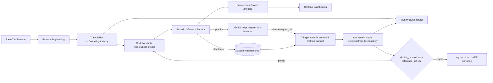
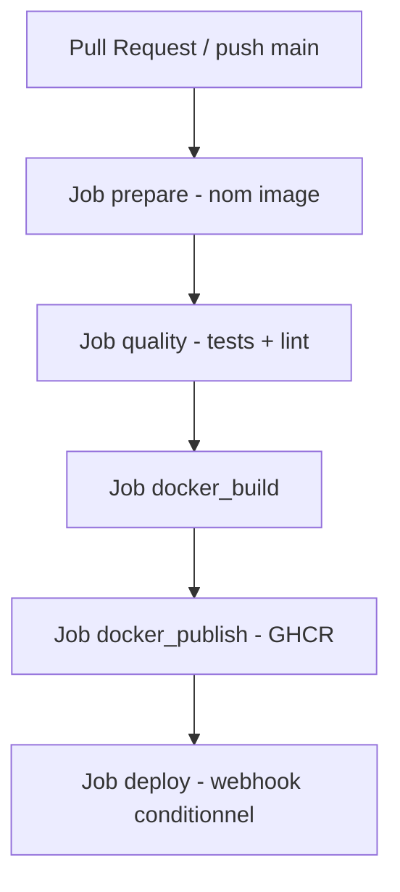
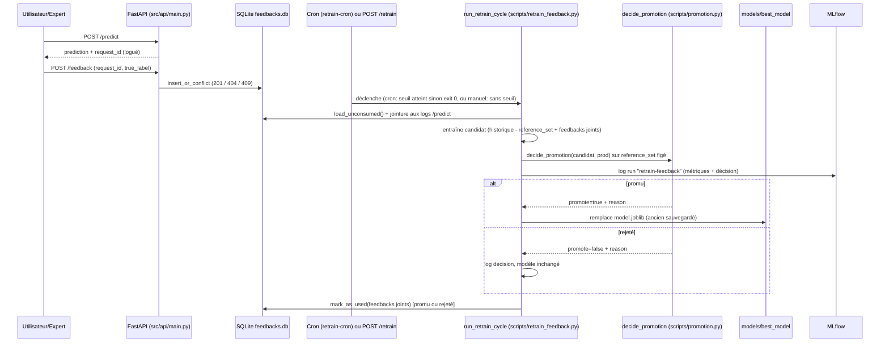
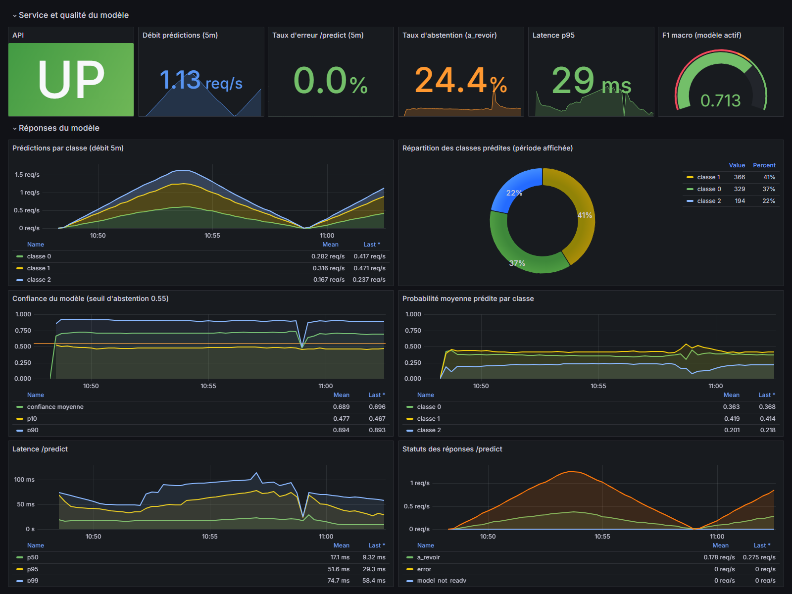
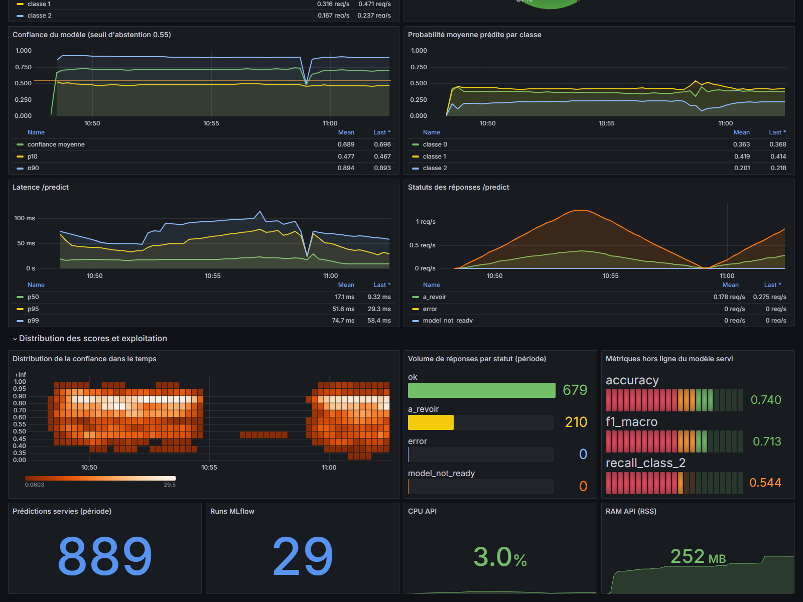

# Portfolio Classification Multimodale


## Résumé

Ce projet montre un cycle ML complet, de la modélisation au monitoring de service, sur un cas d'usage de classification multiclasse du délai de retour à l'emploi.

Le modèle est entraîné sur un dataset de 2 500 lignes qui combine:
- des variables tabulaires (âge, diplôme, ancienneté, statut allocataire, code ROME, zone géographique, variable sensible),
- un texte libre de synthèse d'entretien.

Target à prédire: `classe_retour_emploi`
- classe 0: retour rapide (< 6 mois)
- classe 1: retour moyen (6 à 12 mois)
- classe 2: risque de longue durée (> 12 mois)

Aujourd'hui, le projet couvre déjà:

| Partie | En place |
|---|---|
| Modèle | Pipeline XGBoost S2 multimodal, sans variable sensible directe |
| Docker | Image API + orchestration locale via Docker Compose |
| API | Service FastAPI avec `/health`, `/predict`, `/retrain`, `/history`, `/metrics` |
| Interface | UI de démo pour tester une prédiction et relire les dernières inférences |
| Suivi ML | Serveur MLflow Docker pour les runs, métriques et artefacts |
| Monitoring | Supervision Prometheus + Grafana (métriques de sortie modèle) |
| Delivery | CI/CD GitHub Actions (tests, build, publication de l'image) |
| Boucle de feedback | Endpoint `/feedback`, stockage SQLite, trigger cron, réentraînement + promotion automatisés |

## Sommaire

1. [Problème métier](#problème-métier)
2. [Architecture du système](#architecture-du-système)
3. [Stratégie de modélisation](#stratégie-de-modélisation)
4. [Contrat API](#contrat-api)
5. [Boucle de feedback et réentraînement](#boucle-de-feedback-et-réentraînement)
6. [Stack de supervision](#stack-de-supervision)
7. [Pipeline CI/CD](#pipeline-cicd)
8. [Démarrage rapide](#démarrage-rapide)
9. [Tutoriel : tester la boucle de feedback de bout en bout](#tutoriel--tester-la-boucle-de-feedback-de-bout-en-bout)
10. [UI et captures d'écran](#ui-et-captures-décran)
11. [Structure du dépôt](#structure-du-dépôt)
12. [Livrables certification](#livrables-certification)

## Problème métier

Objectif: prédire le délai de retour à l'emploi en 3 classes à partir de données socio-professionnelles et de verbatims d'entretien.

Contraintes métier:

| Critère | Importance |
|---|---|
| F1 macro | Qualité globale multiclasse |
| Recall classe critique | Réduction des faux négatifs à impact fort |
| Erreurs critiques 2 -> 0 | Indicateur métier prioritaire |

Références métier et décisions:

- [docs/runbooks/decision-log.md](docs/runbooks/decision-log.md)
- [reports/journal/journal-de-bord.ipynb](reports/journal/journal-de-bord.ipynb)

## Architecture du système





### Boucle de feedback



Fichiers d'infrastructure:

- [docker-compose.yml](docker-compose.yml)
- [infra/docker/Dockerfile](infra/docker/Dockerfile)
- [infra/compose/prometheus/prometheus.yml](infra/compose/prometheus/prometheus.yml)
- [infra/compose/grafana/provisioning/dashboards/json/multimodal-api-overview.json](infra/compose/grafana/provisioning/dashboards/json/multimodal-api-overview.json)

## Stratégie de modélisation

Le script d'entraînement principal est dans [src/modeling/train.py](src/modeling/train.py).

| Élément | Détail |
|---|---|
| Modèle final | XGBoost (S2 multimodal sans variable sensible) |
| Features | numériques + diplôme ordinal + catégorielles nominales + texte |
| Garde-fou | `nationalite_hors_ue` exclue de l'entraînement et de l'API |
| Persistance | joblib + metadata JSON |
| Tracking | MLflow local |

Commandes utiles:

```bash
python -m src.modeling.train
python -m src.modeling.train --mlflow-experiment multimodal-classification --mlflow-tracking-uri ./mlruns
```

## Contrat API

Implémentation: [src/api/main.py](src/api/main.py)

| Endpoint | Rôle | Retour |
|---|---|---|
| GET /health | état de service | statut + version modèle |
| POST /predict | inférence unitaire | classe, confiance, statut |
| POST /retrain | réentraînement manuel + décision de promotion | status (`promoted`/`rejected`/`skipped`), event_id, métriques, raison |
| GET /history | historique des inférences | derniers événements journalisés |
| GET /metrics | exposition Prometheus | métriques process + applicatives |
| POST /feedback | annotation vérité terrain | 201 stocké / 409 conflit / 422 label invalide |
| GET /feedback/count | pilotage du trigger de réentraînement | total + non consommés |
| GET /feedback/health | santé de la collecte de feedback | statut + compteurs |
| GET /models/history | snapshots de modèle archivées | liste horodatée + métriques |
| POST /rollback | restaure une snapshot archivée | status, timestamp restauré, métriques |

Implémentation boucle de feedback: [src/api/feedback_store.py](src/api/feedback_store.py) (SQLite) · [scripts/retrain_feedback.py](scripts/retrain_feedback.py) (réentraînement) · [scripts/promotion.py](scripts/promotion.py) (décision testable) · [docs/runbooks/decision-log.md](docs/runbooks/decision-log.md) (DEC-027/028, politique écrite) · [docs/FEEDBACK_LOOP.md](docs/FEEDBACK_LOOP.md) (guide complet).

Swagger local:

```text
http://127.0.0.1:8000/docs
```

## Boucle de feedback et réentraînement

Cycle complet documenté dans **[docs/FEEDBACK_LOOP.md](docs/FEEDBACK_LOOP.md)** : schéma SQLite, jointure feedback ⋈ logs de prédiction, garde-seuil du cron, politique de promotion (`recall_class_2` prioritaire), intégration Docker (`retrain-cron`) et GitHub Actions, tests, troubleshooting.

## Stack de supervision

La stack de supervision combine métriques techniques, métriques API et journaux structurés.

| Source | Type | Emplacement |
|---|---|---|
| FastAPI /metrics | Prometheus exposition | [src/api/main.py](src/api/main.py) |
| Logs inférence | JSONL | [logs/inference](logs/inference) |
| Logs entraînement | JSONL | [logs/inference](logs/inference) |
| Dashboard Grafana | provisionné | [infra/compose/grafana/provisioning](infra/compose/grafana/provisioning) |

Accès locaux:

| Outil | URL |
|---|---|
| API Docs | http://127.0.0.1:8000/docs |
| Prometheus | http://127.0.0.1:9090 |
| Grafana | http://127.0.0.1:3000 |
| MLflow UI | http://127.0.0.1:5000 |

## Pipeline CI/CD

Workflow: [.github/workflows/ci.yml](.github/workflows/ci.yml)

| Job | But |
|---|---|
| prepare | normaliser le nom d'image en minuscules |
| quality | tests + lint informatif |
| docker_build | build image API |
| docker_publish | push GHCR sur main |
| deploy | webhook conditionnel |

Workflow de réentraînement: [.github/workflows/retrain.yml](.github/workflows/retrain.yml) — déclenchement manuel (`workflow_dispatch`) ou planifié (cron quotidien), exécute `scripts/retrain_feedback.py`, puis build/push/redéploie l'image **uniquement si le candidat est promu**.

## Démarrage rapide

### 1) Préparer Python

```bash
uv venv --python 3.12
uv pip install -r requirements.txt
```

### 2) Entraîner le modèle

```bash
python -m src.modeling.train
```

### 3) Lancer l'API

```bash
uvicorn src.api.main:app --reload
```

Sous Windows:

```bash
.venv/Scripts/python.exe -m uvicorn src.api.main:app --reload
```

### 4) Lancer la stack complète (API + MLflow + Prometheus + Grafana)

```bash
docker compose up -d --build
```

## Tutoriel : Tester la boucle de feedback de bout en bout

Avec la stack lancée (Docker ou `uvicorn` en local, port 8000), les trois scripts suivants permettent de rejouer tout le cycle sans attendre de vraies annotations terrain.

### 1) Vérifier que l'API répond

```bash
curl http://localhost:8000/health
# -> {"status": "ok", "model_loaded": true, ...}
```

### 2) Générer du trafic réaliste (`scripts/generate_traffic.py`)

Envoie des requêtes `/predict` en piochant dans le split de test **jamais vu à l'entraînement** (+ un peu de trafic synthétique et de payloads malformés), pour peupler les logs et les métriques Grafana.

```bash
python scripts/generate_traffic.py --url http://localhost:8000 --requests 300
```

| Argument | Défaut | Rôle |
|---|---|---|
| `--url` | `http://localhost:8000` | URL de base de l'API |
| `--requests` | *(aucun)* | Nombre total d'appels `/predict` (à fixer si pas de `--duration`) |
| `--duration` | *(aucun)* | Durée d'exécution en secondes, alternative à `--requests` |
| `--rps` | `2.0` | Débit cible (requêtes/seconde) |
| `--error-rate` | `0.1` | Fraction de payloads volontairement malformés (0–1) |
| `--real-ratio` | `0.5` | Fraction de payloads réels issus du split de test (le reste est synthétique) |
| `--retrain-every` | *(aucun)* | Déclenche `/retrain` toutes les N requêtes |
| `--timeout` | `5.0` | Timeout par requête (secondes) |

### 3) Générer des feedbacks à partir des prédictions réelles (`scripts/generate_feedback.py`)

Relit `logs/inference/api_predict_requests.jsonl` et poste des annotations `POST /feedback` sur des `request_id` réellement logués (simule un accord expert avec la classe prédite selon `--agreement`).

```bash
python scripts/generate_feedback.py --url http://localhost:8000 --count 220 --agreement 0.8
```

| Argument | Défaut | Rôle |
|---|---|---|
| `--url` | `http://localhost:8000` | URL de base de l'API |
| `--count` | `250` | Nombre de feedbacks à envoyer |
| `--agreement` | `0.8` | Probabilité que le feedback confirme la classe prédite (sinon une autre classe au hasard) |
| `--timeout` | `5.0` | Timeout par requête (secondes) |

```bash
curl http://localhost:8000/feedback/count
# -> {"total": 220, "new": 220}
```

### 4) Déclencher le réentraînement (`scripts/retrain_feedback.py`)

Même cycle que le cron (`run_retrain_cycle`) : jointure feedbacks ⋈ logs, entraînement d'un candidat, comparaison au modèle en production sur le `reference_set` figé, décision de promotion journalisée (log + run MLflow).

```bash
python scripts/retrain_feedback.py --min-feedback 200
```

| Argument | Défaut | Rôle |
|---|---|---|
| `--min-feedback` | `200` | Nombre minimum de feedbacks non consommés pour déclencher le cycle (sinon `SKIP`, exit 0) |

Alternative sans seuil, via l'API (utilise les feedbacks déjà disponibles, même s'il y en a peu) :

```bash
curl -X POST http://localhost:8000/retrain -H "Content-Type: application/json" -d "{\"trigger\": \"manual_test\"}"
# -> {"status": "promoted"|"rejected"|"skipped", "event_id": "...", "metrics": {...}, "reason": "..."}
```

### 5) Vérifier le résultat

```bash
# Log détaillé du cycle
Get-Content logs/retraining/retrain.log -Tail 50

# Si Docker : le service retrain-cron tourne la même logique toutes les 6h
docker compose logs retrain-cron

# Run MLflow créé (promu ou rejeté)
# -> http://127.0.0.1:5000, expérience "multimodal-classification", run "retrain-feedback"
```

Guide complet (schéma, politique de promotion, troubleshooting) : **[docs/FEEDBACK_LOOP.md](docs/FEEDBACK_LOOP.md)**.

## UI et captures d'écran

Répertoire UI: [app/ui](app/ui)

### UI - Formulaire de prédiction et historique


### UI - Résultat de prédiction


### API - Swagger


### Monitoring - Prometheus targets


### Monitoring - Grafana : service, qualité du modèle et réponses


### Monitoring - Grafana : distribution des scores et exploitation


## Structure du dépôt

| Dossier | Rôle |
|---|---|
| [src](src) | code data, features, modeling, api |
| [tests](tests) | tests API et configuration test |
| [infra](infra) | docker, compose, provisioning observabilité |
| [models](models) | artefacts modèle |
| [reports](reports) | figures, métriques, journal, soutenance |
| [docs](docs) | runbooks, gouvernance, architecture |

## Livrables certification

| Livrable | Emplacement |
|---|---|
| Notebook principal | [notebooks/multimodal-classification.ipynb](notebooks/multimodal-classification.ipynb) |
| Journal de bord | [reports/journal/journal-de-bord.ipynb](reports/journal/journal-de-bord.ipynb) |
| Decision log | [docs/runbooks/decision-log.md](docs/runbooks/decision-log.md) |


