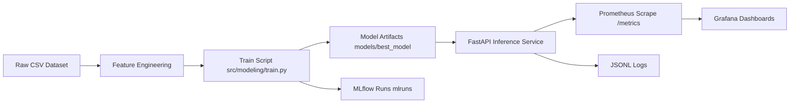
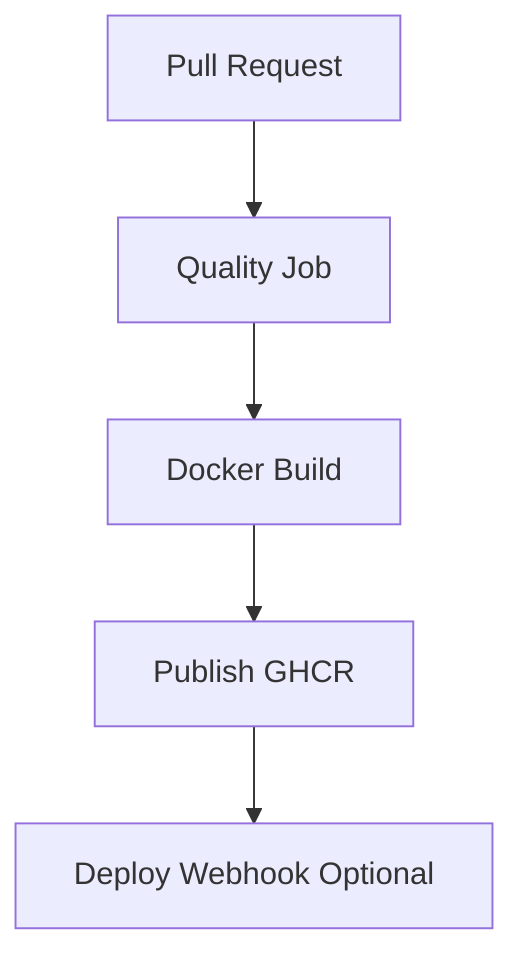

# Multimodal Classification Portfolio


## Executive Summary

Ce projet montre un cycle ML complet, de la modélisation au monitoring de service, sur un cas d'usage de classification multiclasse du délai de retour à l'emploi.

Points forts:

| Axe | Ce qui est en place |
|---|---|
| Modeling | Pipeline tabulaire + texte, scénario S1 XGBoost, entraînement scriptable |
| Serving | API FastAPI avec endpoints health, predict, retrain, metrics |
| Observability | Prometheus + Grafana, logs JSONL, métriques applicatives |
| Tracking | Runs MLflow (paramètres, métriques, artifacts, run metadata) |
| Delivery | Workflow GitHub Actions CI/CD, build Docker, publication image GHCR |

## Portfolio Table Of Contents

1. [Business Problem](#business-problem)
2. [System Architecture](#system-architecture)
3. [Modeling Strategy](#modeling-strategy)
4. [API Contract](#api-contract)
5. [Observability Stack](#observability-stack)
6. [CI/CD Pipeline](#cicd-pipeline)
7. [Quickstart](#quickstart)
8. [UI And Screenshots](#ui-and-screenshots)
9. [Repository Structure](#repository-structure)
10. [Certification Deliverables](#certification-deliverables)

## Business Problem

Objectif: prédire le délai de retour à l'emploi en 3 classes à partir de données socio-professionnelles et de verbatims d'entretien.

Contraintes métier:

| Critère | Importance |
|---|---|
| F1 macro | Qualité globale multiclasse |
| Recall classe critique | Réduction des faux négatifs à impact fort |
| Erreurs critiques 2 -> 0 | Indicateur métier prioritaire |

Références métier et décisions:

- [docs/runbooks/decision-log.md](docs/runbooks/decision-log.md)
- [reports/journal/journal-de-bord.ipynb](reports/journal/journal-de-bord.ipynb)

## System Architecture





Infrastructure files:

- [docker-compose.yml](docker-compose.yml)
- [infra/docker/Dockerfile](infra/docker/Dockerfile)
- [infra/compose/prometheus/prometheus.yml](infra/compose/prometheus/prometheus.yml)
- [infra/compose/grafana/provisioning/dashboards/json/multimodal-api-overview.json](infra/compose/grafana/provisioning/dashboards/json/multimodal-api-overview.json)

## Modeling Strategy

Le script d'entraînement principal est dans [src/modeling/train.py](src/modeling/train.py).

| Élément | Détail |
|---|---|
| Modèle final | XGBoost (S1 multimodal complet) |
| Features | numériques + catégorielles + texte |
| Persistance | joblib + metadata JSON |
| Tracking | MLflow local |

Commandes utiles:

```bash
python -m src.modeling.train
python -m src.modeling.train --mlflow-experiment multimodal-classification --mlflow-tracking-uri ./mlruns
```

## API Contract

Implémentation: [src/api/main.py](src/api/main.py)

| Endpoint | Rôle | Retour |
|---|---|---|
| GET /health | état de service | statut + version modèle |
| POST /predict | inférence unitaire | classe, confiance, statut |
| POST /retrain | réentraînement | event_id, version, métriques |
| POST /train | alias de /retrain | idem |
| GET /metrics | exposition Prometheus | métriques process + applicatives |

Swagger local:

```text
http://127.0.0.1:8000/docs
```

## Observability Stack

La stack d'observabilité combine métriques techniques, métriques API et journaux structurés.

| Source | Type | Emplacement |
|---|---|---|
| FastAPI /metrics | Prometheus exposition | [src/api/main.py](src/api/main.py) |
| Logs inférence | JSONL | [logs/inference](logs/inference) |
| Logs entraînement | JSONL | [logs/inference](logs/inference) |
| Dashboard Grafana | provisionné | [infra/compose/grafana/provisioning](infra/compose/grafana/provisioning) |

Accès locaux:

| Outil | URL |
|---|---|
| API Docs | http://127.0.0.1:8000/docs |
| Prometheus | http://127.0.0.1:9090 |
| Grafana | http://127.0.0.1:3000 |
| MLflow UI | http://127.0.0.1:5000 |

## CI/CD Pipeline

Workflow: [.github/workflows/ci.yml](.github/workflows/ci.yml)

| Job | But |
|---|---|
| prepare | normaliser le nom d'image en minuscules |
| quality | tests + lint informatif |
| docker_build | build image API |
| docker_publish | push GHCR sur main |
| deploy | webhook conditionnel |

## Quickstart

### 1) Setup Python

```bash
uv venv --python 3.12
uv pip install -r requirements.txt
```

### 2) Train

```bash
python -m src.modeling.train
```

### 3) Run API

```bash
uvicorn src.api.main:app --reload
```

Sous Windows:

```bash
.venv/Scripts/python.exe -m uvicorn src.api.main:app --reload
```

### 4) Full stack (API + Prometheus + Grafana)

```bash
docker compose up -d --build
```

## UI And Screenshots

Répertoire UI: [app/ui](app/ui)

Répertoire screenshots: [reports/figures](reports/figures)

Checklist portfolio visuel:

| Capture | Statut |
|---|---|
| Swagger endpoint /predict | A ajouter |
| Grafana dashboard overview | A ajouter |
| Prometheus target up | A ajouter |
| MLflow runs page | A ajouter |
| CI GitHub Actions success | A ajouter |

Format recommandé des captures:

- 1600x900 minimum
- nommage clair (ex: grafana-overview.png)
- une capture par composant clé

## Repository Structure

| Dossier | Rôle |
|---|---|
| [src](src) | code data, features, modeling, api |
| [tests](tests) | tests API et configuration test |
| [infra](infra) | docker, compose, provisioning observabilité |
| [models](models) | artefacts modèle |
| [reports](reports) | figures, métriques, journal, soutenance |
| [docs](docs) | runbooks, gouvernance, architecture |

## Certification Deliverables

| Livrable | Emplacement |
|---|---|
| Notebook principal | [notebooks/multimodal-classification.ipynb](notebooks/multimodal-classification.ipynb) |
| Journal de bord | [reports/journal/journal-de-bord.ipynb](reports/journal/journal-de-bord.ipynb) |
| Decision log | [docs/runbooks/decision-log.md](docs/runbooks/decision-log.md) |
| Plan soutenance | [reports/soutenance/presentation-plan.md](reports/soutenance/presentation-plan.md) |

## Next Portfolio Upgrades

1. Ajouter les captures UI/API/monitoring dans [reports/figures](reports/figures).
2. Ajouter une section Benchmarks avec tableaux chiffrés consolidés.
3. Ajouter une section Demo vidéo courte.
