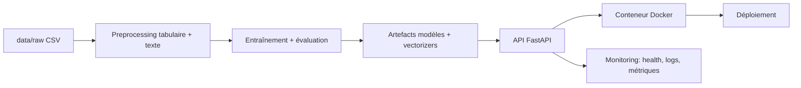

# Prédiction du délai de retour à l'emploi

J'ai développé une solution IA multimodale pour prédire le délai de retour à l'emploi à partir de données tabulaires et textuelles.

L'objectif de ce dépôt est simple : montrer un projet de bout en bout, depuis la modélisation jusqu'à l'industrialisation (API, qualité, conteneurisation et déploiement).

## Vue rapide

- Problème : classification multiclasse du délai de retour à l'emploi.
- Données : variables structurées + texte d'entretien.
- Stack : Python, scikit-learn, XGBoost/LightGBM, FastAPI, Pytest, GitHub Actions.
- Cible : passer d'un notebook de recherche à une application ML testée, documentée et déployable.

## Architecture



## Modèle

- Tâche : classification à 3 classes.
- Approche : comparaison de scénarios tabulaire seul vs multimodal tabulaire + texte.
- Familles de modèles explorées : baseline scikit-learn + candidats tree-based (XGBoost, LightGBM).
- Priorité métier : réduire les erreurs critiques sur la classe la plus risquée.

Référence de travail : notebooks/multimodal-classification.ipynb

## Résultats et métriques

Le projet suit aujourd'hui :

- F1 macro pour la qualité globale multiclasse.
- Recall de la classe critique pour l'alignement métier.
- Matrice de confusion pour analyser les erreurs à fort impact.

Seuils cibles définis dans le notebook :

- F1 macro >= 0.70
- Recall classe critique >= 0.80

Publication portfolio prévue :

- Tableau comparatif final des modèles dans reports/metrics/
- Figure de matrice de confusion dans reports/figures/
- Synthèse des arbitrages dans docs/runbooks/decision-log.md

## API

Statut : implémentation de base opérationnelle (FastAPI).

Surface cible :

- GET /health : vérifier la disponibilité du service
- POST /predict : inférer la classe de délai de retour à l'emploi
- POST /retrain (alias POST /train) : réentraîner le modèle et recharger les artefacts
- GET /metrics : exposer des indicateurs techniques

Mode d'exploitation actuel :

- API minimale de mise à disposition d'un modèle déjà entraîné.
- Le réentraînement peut être déclenché via l'API (`/retrain` ou `/train`) ou hors API (pipeline/notebook).
- Les inférences sont journalisées dans `logs/inference/api_predict_requests.jsonl`.
- Les événements d'entraînement sont journalisés dans `logs/inference/api_train_events.jsonl`.
- Les runs d'entraînement sont tracés avec MLflow (paramètres, métriques, artefacts modèle).

Objectif portfolio : documentation Swagger exploitable, avec des exemples de requêtes et de réponses.

Lancement local :

1) Entraîner le modèle (si nécessaire) :

```bash
python -m src.modeling.train
```

2) Démarrer l'API :

```bash
uvicorn src.api.main:app --reload
```

Sous Windows avec le venv du projet :

```bash
.venv/Scripts/python.exe -m uvicorn src.api.main:app --reload
```

3) Tester rapidement :

```bash
curl http://127.0.0.1:8000/health
```

```bash
curl -X POST http://127.0.0.1:8000/predict -H "Content-Type: application/json" -d '{"usager_id":"U_TEST_001","age":36,"niveau_diplome":"bac+2","anciennete_poste_ans":4.0,"code_rome_vise":"M1805","code_insee_commune":"75101","est_allocataire":1,"nationalite_hors_ue":0,"departement_insee":"75","synthese_entretien":"Motivation stable, projet coherent, recherche active."}'
```

Swagger UI :

```text
http://127.0.0.1:8000/docs
```

### Brancher Prometheus et Grafana en local

Option A - Stack Docker complete (API + Prometheus + Grafana) :

1) Construire et démarrer la stack :

```bash
docker compose up -d --build
```

2) Ouvrir les interfaces :

```text
API docs: http://127.0.0.1:8000/docs
Prometheus: http://127.0.0.1:9090
Grafana: http://127.0.0.1:3000
```

Connexion Grafana (par défaut) :

- login: `admin`
- mot de passe: `admin`

La datasource Prometheus est provisionnée automatiquement.
Un dashboard est aussi provisionné automatiquement : `Multimodal API > Multimodal API Overview`.

3) Vérifier la cible :

- Dans `Status > Targets`, le job `multimodal-api` doit être `UP`.

La configuration de scrape est dans `infra/compose/prometheus/prometheus.yml`.

## Docker et déploiement

Statut : structure prête, finalisation en cours.

- Dossiers cibles : infra/docker/, infra/compose/, infra/deployment/
- Étape suivante : exécution locale en une commande puis déploiement cloud (Render, Azure, Railway ou VM)

## Captures d'écran à inclure

Pour rendre la valeur visible en 30 secondes pour un recruteur :

- Swagger UI de l'API
- Exemple de réponse POST /predict
- Pipeline CI GitHub Actions au vert
- Écran du service déployé

Emplacement recommandé : reports/figures/

## État actuel

- Notebook principal de modélisation disponible
- Environnement Python 3.12 et dépendances ML/API préconfigurées
- CI GitHub Actions présente
- Documentation de gouvernance déjà structurée

### Avancement du projet

- [x] Structuration projet (data, src, tests, infra, docs, reports)
- [x] Base CI sur GitHub Actions
- [x] Gouvernance (decision log, conventions)
- [x] Extraction du socle preprocessing/training/inference vers src/
- [x] API FastAPI de base opérationnelle
- [ ] Tests exécutés en CI
- [ ] Docker / Docker Compose finalisés
- [ ] Déploiement cible

## Installation locale

Prérequis : Python 3.12

```bash
uv venv --python 3.12
uv pip install -r requirements.txt
```

## Entrainement hors notebook

Module Python pour entrainer directement le modele final XGBoost du scenario S1 (multimodal complet) et sauvegarder les artefacts:

```bash
python -m src.modeling.train
```

Avec options MLflow:

```bash
python -m src.modeling.train --mlflow-experiment multimodal-classification --mlflow-tracking-uri ./mlruns
```

Interface MLflow locale:

```bash
mlflow ui --backend-store-uri ./mlruns --port 5000
```

Puis ouvrir:

```text
http://127.0.0.1:5000
```

Avec un CSV explicite:

```bash
python -m src.modeling.train --csv-path data/raw/mon_dataset.csv
```

## Structure du dépôt

- brief/: sujet et consignes
- data/: données brutes, intermédiaires et préparées
- src/: modules Python (data, features, modeling, evaluation, api, monitoring, utils)
- models/: artefacts modèles et vectorizers
- tests/: tests unitaires, intégration, API
- infra/: conteneurisation et déploiement
- docs/: architecture, model cards, RGPD/éthique, runbooks
- reports/: journal, métriques, soutenance
- .github/workflows/: CI

## Livrables certification conservés

Le projet conserve les livrables attendus pour la certification CISIA :

- Notebook final : notebooks/multimodal-classification.ipynb
- Support de soutenance : reports/soutenance/presentation-plan.md
- Journal de bord : reports/journal/journal-de-bord.ipynb
- Journal de décisions : docs/runbooks/decision-log.md

## Roadmap portfolio

1. Industrialiser le pipeline d'entraînement dans src/ (fit, evaluation, serialization).
2. Exposer le modèle via FastAPI (predict, health, metrics).
3. Ajouter tests Pytest (payload, inference, regression métriques).
4. Dockeriser l'API et documenter un run local one-command.
5. Publier résultats, captures et démo déployée.

## Note

Certains dossiers contiennent encore des .gitkeep : ils représentent des zones prévues, qui seront remplies au fur et à mesure de la finalisation.
