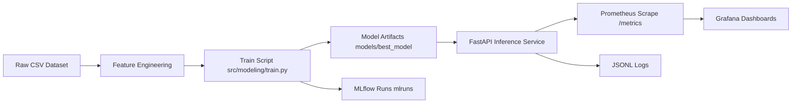
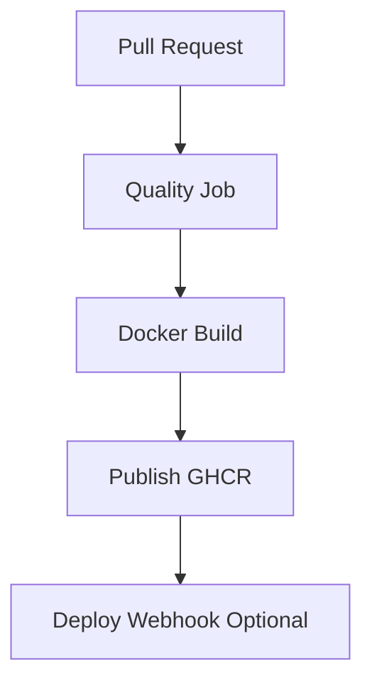
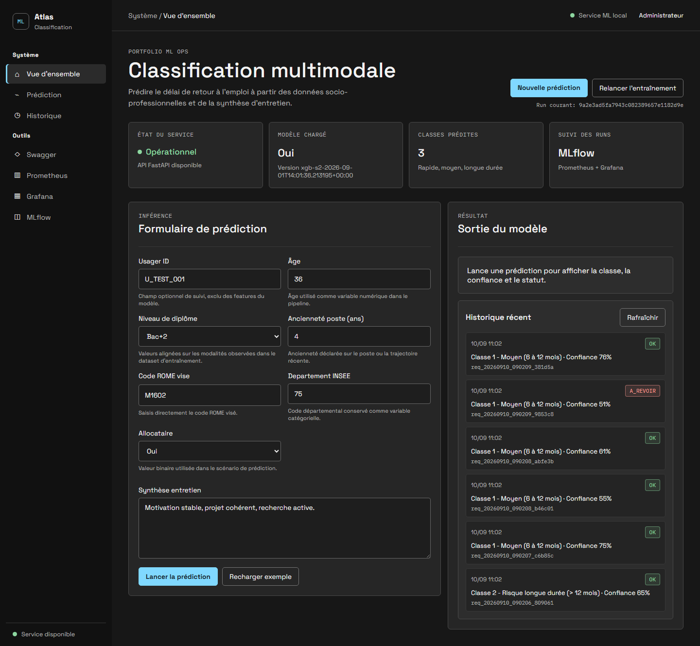
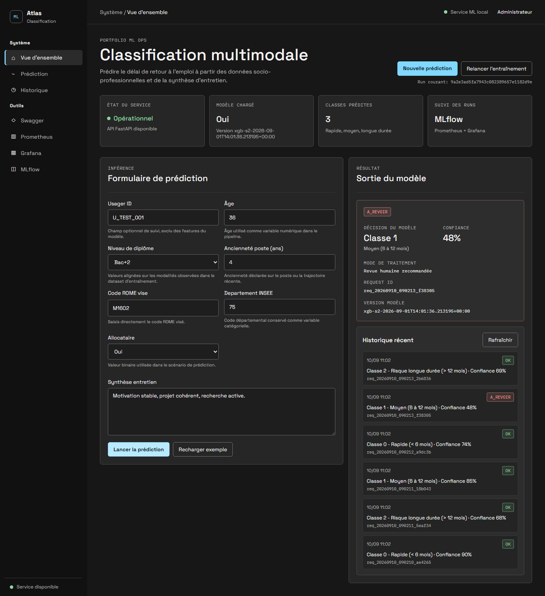
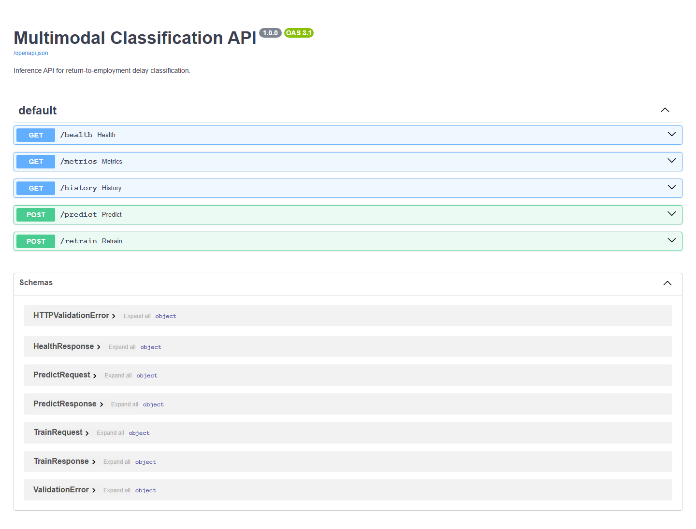
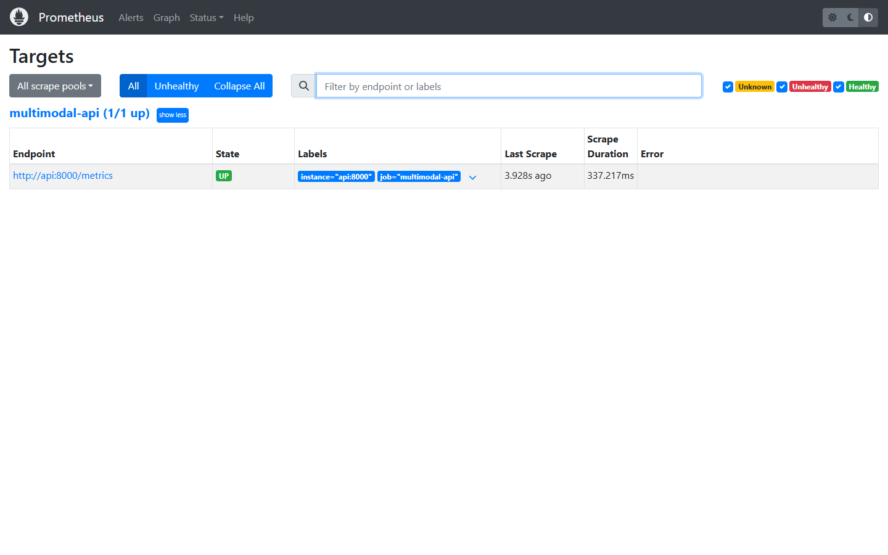
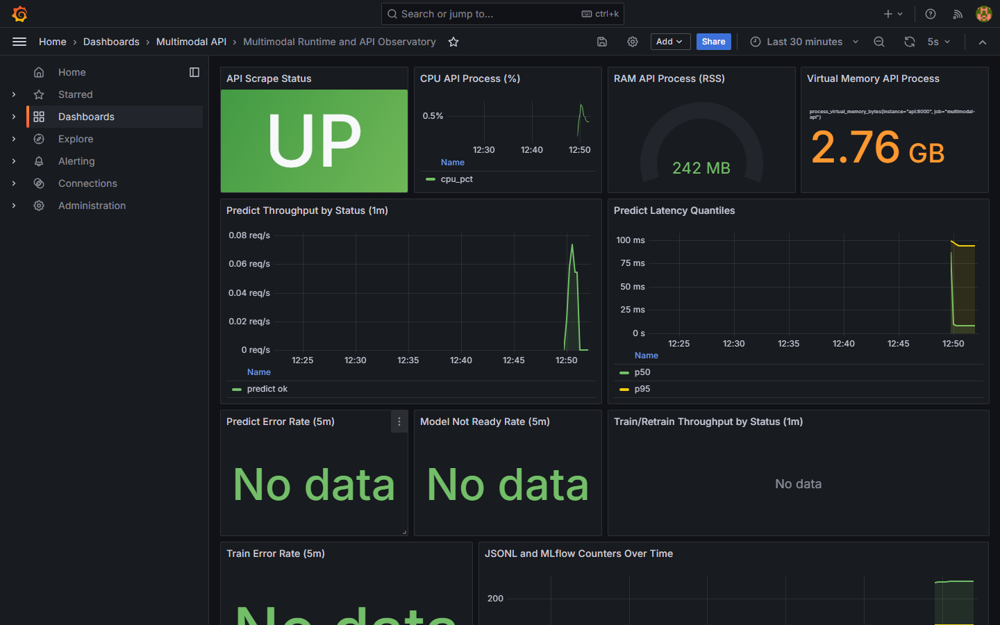

# Portfolio Classification Multimodale


## Résumé

Ce projet montre un cycle ML complet, de la modélisation au monitoring de service, sur un cas d'usage de classification multiclasse du délai de retour à l'emploi.

Le modèle est entraîné sur un dataset de 2 500 lignes qui combine:
- des variables tabulaires (âge, diplôme, ancienneté, statut allocataire, code ROME, zone géographique, variable sensible),
- un texte libre de synthèse d'entretien.

Target à prédire: `classe_retour_emploi`
- classe 0: retour rapide (< 6 mois)
- classe 1: retour moyen (6 à 12 mois)
- classe 2: risque de longue durée (> 12 mois)

Aujourd'hui, le projet couvre déjà:

| Partie | En place |
|---|---|
| Modèle | Pipeline multimodal tabulaire + texte avec XGBoost |
| API | Service FastAPI avec `/health`, `/predict`, `/retrain`, `/history`, `/metrics` |
| Interface | UI de démo pour tester une prédiction et relire les dernières inférences |
| Suivi ML | Tracking MLflow des runs (paramètres, métriques, artefacts) |
| Monitoring | Supervision Prometheus + Grafana |
| Delivery | CI/CD GitHub Actions (tests, build, publication de l'image) |

## Sommaire

1. [Problème métier](#problème-métier)
2. [Architecture du système](#architecture-du-système)
3. [Stratégie de modélisation](#stratégie-de-modélisation)
4. [Contrat API](#contrat-api)
5. [Stack de supervision](#stack-de-supervision)
6. [Pipeline CI/CD](#pipeline-cicd)
7. [Démarrage rapide](#démarrage-rapide)
8. [UI et captures d'écran](#ui-et-captures-décran)
9. [Structure du dépôt](#structure-du-dépôt)
10. [Livrables certification](#livrables-certification)

## Problème Métier

Objectif: prédire le délai de retour à l'emploi en 3 classes à partir de données socio-professionnelles et de verbatims d'entretien.

Contraintes métier:

| Critère | Importance |
|---|---|
| F1 macro | Qualité globale multiclasse |
| Recall classe critique | Réduction des faux négatifs à impact fort |
| Erreurs critiques 2 -> 0 | Indicateur métier prioritaire |

Références métier et décisions:

- [docs/runbooks/decision-log.md](docs/runbooks/decision-log.md)
- [reports/journal/journal-de-bord.ipynb](reports/journal/journal-de-bord.ipynb)

## Architecture Du Système





Fichiers d'infrastructure:

- [docker-compose.yml](docker-compose.yml)
- [infra/docker/Dockerfile](infra/docker/Dockerfile)
- [infra/compose/prometheus/prometheus.yml](infra/compose/prometheus/prometheus.yml)
- [infra/compose/grafana/provisioning/dashboards/json/multimodal-api-overview.json](infra/compose/grafana/provisioning/dashboards/json/multimodal-api-overview.json)

## Stratégie De Modélisation

Le script d'entraînement principal est dans [src/modeling/train.py](src/modeling/train.py).

| Élément | Détail |
|---|---|
| Modèle final | XGBoost (S1 multimodal complet) |
| Features | numériques + catégorielles + texte |
| Persistance | joblib + metadata JSON |
| Tracking | MLflow local |

Commandes utiles:

```bash
python -m src.modeling.train
python -m src.modeling.train --mlflow-experiment multimodal-classification --mlflow-tracking-uri ./mlruns
```

## Contrat API

Implémentation: [src/api/main.py](src/api/main.py)

| Endpoint | Rôle | Retour |
|---|---|---|
| GET /health | état de service | statut + version modèle |
| POST /predict | inférence unitaire | classe, confiance, statut |
| POST /retrain | réentraînement | event_id, version, métriques |
| GET /history | historique des inférences | derniers événements journalisés |
| GET /metrics | exposition Prometheus | métriques process + applicatives |

Swagger local:

```text
http://127.0.0.1:8000/docs
```

## Stack De Supervision

La stack de supervision combine métriques techniques, métriques API et journaux structurés.

| Source | Type | Emplacement |
|---|---|---|
| FastAPI /metrics | Prometheus exposition | [src/api/main.py](src/api/main.py) |
| Logs inférence | JSONL | [logs/inference](logs/inference) |
| Logs entraînement | JSONL | [logs/inference](logs/inference) |
| Dashboard Grafana | provisionné | [infra/compose/grafana/provisioning](infra/compose/grafana/provisioning) |

Accès locaux:

| Outil | URL |
|---|---|
| API Docs | http://127.0.0.1:8000/docs |
| Prometheus | http://127.0.0.1:9090 |
| Grafana | http://127.0.0.1:3000 |
| MLflow UI | http://127.0.0.1:5000 |

## Pipeline CI/CD

Workflow: [.github/workflows/ci.yml](.github/workflows/ci.yml)

| Job | But |
|---|---|
| prepare | normaliser le nom d'image en minuscules |
| quality | tests + lint informatif |
| docker_build | build image API |
| docker_publish | push GHCR sur main |
| deploy | webhook conditionnel |

## Démarrage Rapide

### 1) Préparer Python

```bash
uv venv --python 3.12
uv pip install -r requirements.txt
```

### 2) Entraîner le modèle

```bash
python -m src.modeling.train
```

### 3) Lancer l'API

```bash
uvicorn src.api.main:app --reload
```

Sous Windows:

```bash
.venv/Scripts/python.exe -m uvicorn src.api.main:app --reload
```

### 4) Lancer la stack complète (API + Prometheus + Grafana)

```bash
docker compose up -d --build
```

## UI Et Captures D'Écran

Répertoire UI: [app/ui](app/ui)

### UI - Formulaire de prédiction et historique


### UI - Résultat de prédiction


### API - Swagger


### Monitoring - Prometheus targets


### Monitoring - Grafana Dashboard


## Structure Du Dépôt

| Dossier | Rôle |
|---|---|
| [src](src) | code data, features, modeling, api |
| [tests](tests) | tests API et configuration test |
| [infra](infra) | docker, compose, provisioning observabilité |
| [models](models) | artefacts modèle |
| [reports](reports) | figures, métriques, journal, soutenance |
| [docs](docs) | runbooks, gouvernance, architecture |

## Livrables Certification

| Livrable | Emplacement |
|---|---|
| Notebook principal | [notebooks/multimodal-classification.ipynb](notebooks/multimodal-classification.ipynb) |
| Journal de bord | [reports/journal/journal-de-bord.ipynb](reports/journal/journal-de-bord.ipynb) |
| Decision log | [docs/runbooks/decision-log.md](docs/runbooks/decision-log.md) |
| Plan soutenance | [reports/soutenance/presentation-plan.md](reports/soutenance/presentation-plan.md) |

## Prochaines Améliorations Portfolio

1. Ajouter les captures UI/API/monitoring dans [reports/figures](reports/figures).
2. Ajouter une section Benchmarks avec tableaux chiffrés consolidés.
3. Ajouter une section Demo vidéo courte.
