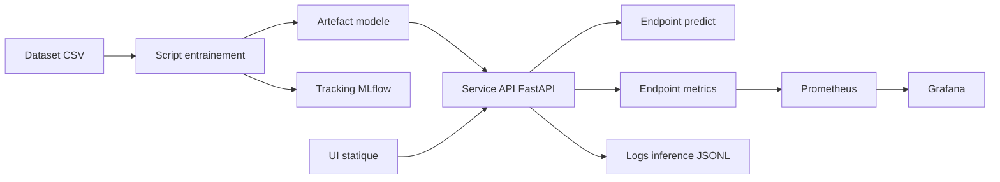

# Architecture SI - Classification multimodale

## 1. Objectif et périmètre
Ce document décrit l'architecture technique du système de classification multimodale, de l'entraînement au serving API, avec supervision et traçabilité.

Périmètre couvert:
- ingestion dataset CSV local;
- entraînement batch et persistance artefacts;
- exposition API de prédiction/retrain;
- observabilité (Prometheus, Grafana, logs JSONL);
- tracking expérimental (MLflow local).

## 2. Composants principaux

| Composant | Rôle | Emplacement |
|---|---|---|
| Service API | Exposer /health, /predict, /retrain, /metrics et UI statique | src/api/main.py |
| UI statique | Formulaire de prédiction et appel API | app/ui |
| Préprocessing | Feature engineering + préparation frame modèle | src/features/preprocessing.py |
| Entraînement | Construction pipeline XGBoost + export artefacts | src/modeling/train.py |
| Artefacts modèle | Pipeline joblib + metadata JSON | models/best_model |
| Tracking ML | Historique runs, métriques, artefacts | mlruns |
| Logs applicatifs | Journaux JSONL inférence et retrain | logs/inference |
| Monitoring | Scrape métriques + dashboards | infra/compose/prometheus, infra/compose/grafana |

## 3. Flux fonctionnels

### 3.1 Entraînement
1. Chargement CSV (data/raw prioritaire).
2. Préparation des features (suppression identifiants techniques, engineering INSEE).
3. Split train/test stratifié.
4. Fit pipeline (préprocessor + XGBoost).
5. Calcul métriques (accuracy, f1_macro, recall classe 2, erreurs critiques 2->0).
6. Sauvegarde modèle/metadata et log MLflow.

### 3.2 Prédiction
1. Réception payload JSON via /predict.
2. Validation schéma Pydantic.
3. Construction model_frame via préprocessing.
4. predict_proba puis décision classe + confiance.
5. Journalisation événement JSONL.

### 3.3 Monitoring
1. Exposition métriques custom API sur /metrics.
2. Scrape Prometheus.
3. Visualisation dashboard Grafana.

## 4. Vue d'architecture (logique)

## 5. Contraintes et choix d'architecture
- Architecture locale et simple pour soutenance/démo.
- API stateless (hors artefacts locaux et logs fichiers).
- Utilisation de Docker Compose pour l'orchestration locale.
- Couplage maîtrisé entre UI statique et API (même service FastAPI).

## 6. Sécurité et exploitation (niveau actuel)
Niveau actuel:
- pas d'authentification applicative;
- pas de chiffrement transport imposé en local;
- pas de gestion de secrets centralisée.

Mesures minimales recommandées avant exposition externe:
- reverse proxy TLS + authentification;
- rotation des secrets et variables d'environnement dédiées;
- limitation de débit sur endpoints sensibles (/predict, /retrain);
- journalisation de sécurité distincte des logs métier.

## 7. Limites connues
- stockage MLflow en file store local (adapté démo, limité pour prod multi-utilisateur);
- dépendance à l'état local des artefacts pour certains tests;
- absence de mécanisme de promotion de modèle (staging/production).

## 8. Roadmap architecture
1. Migrer MLflow vers backend SQL (sqlite minimum, puis serveur dédié).
2. Ajouter un modèle de déploiement avec registre et versioning promu.
3. Introduire authn/authz et observabilité sécurité.
4. Industrialiser tests d'intégration API + UI en CI.
