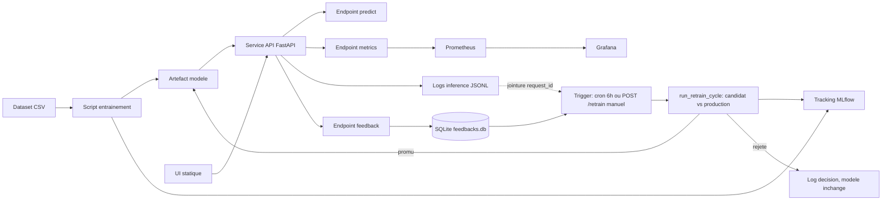

# Architecture SI - Classification multimodale

## 1. Objectif et périmètre
Ce document décrit l'architecture technique du système de classification multimodale, de l'entraînement au serving API, avec supervision et traçabilité.

Périmètre couvert:
- ingestion dataset CSV local;
- entraînement batch et persistance artefacts;
- exposition API de prédiction/retrain;
- observabilité (Prometheus, Grafana, logs JSONL);
- tracking expérimental via serveur MLflow conteneurisé.

## 2. Composants principaux

| Composant | Rôle | Emplacement |
|---|---|---|
| Service API | Exposer /health, /predict, /retrain, /history, /metrics, /feedback* et UI statique | src/api/main.py |
| UI statique | Formulaire de prédiction et appel API | app/ui |
| Préprocessing | Feature engineering + préparation frame modèle | src/features/preprocessing.py |
| Entraînement | Construction pipeline XGBoost + export artefacts | src/modeling/train.py |
| Artefacts modèle | Pipeline joblib + metadata JSON | models/best_model |
| Feedback | Stockage SQLite des annotations terrain (`request_id`, `true_label`, `used_for_training`) | src/api/feedback_store.py, data/feedbacks.db |
| Réentraînement | Jointure feedbacks/logs, candidat, comparaison, décision de promotion | scripts/retrain_feedback.py, scripts/promotion.py |
| Tracking ML | Serveur MLflow, historique des runs (entraînement initial et retrain), métriques et artefacts | service `mlflow`, mlruns |
| Logs applicatifs | Journaux JSONL inférence et retrain | logs/inference, logs/retraining |
| Monitoring | Scrape métriques + dashboards | infra/compose/prometheus, infra/compose/grafana |

## 3. Flux fonctionnels

### 3.1 Entraînement
1. Chargement CSV (data/raw prioritaire).
2. Préparation des features S2 (suppression des identifiants techniques et de `nationalite_hors_ue`, engineering INSEE).
3. Encodage ordinal de `niveau_diplome` (`Sans diplôme < Bac < Bac+2 < Bac+5`) et one-hot encoding des catégories nominales.
4. Split train/test stratifié.
5. Fit pipeline (préprocessor + XGBoost).
6. Calcul métriques (accuracy, f1_macro, recall classe 2, erreurs critiques 2->0).
7. Sauvegarde modèle/metadata et log vers le serveur MLflow.

### 3.2 Prédiction
1. Réception payload JSON via /predict.
2. Validation schéma Pydantic.
3. Rejet de `nationalite_hors_ue`, puis construction du model_frame S2 via préprocessing.
4. predict_proba puis décision classe + confiance.
5. Journalisation événement JSONL.

### 3.3 Monitoring
1. Exposition métriques custom API sur /metrics.
2. Scrape Prometheus.
3. Visualisation dashboard Grafana.

### 3.4 Boucle de feedback et réentraînement
1. Un expert envoie `POST /feedback` (`request_id`, `true_label`) ; le `request_id` doit correspondre à une prédiction déjà loguée (404 sinon), un conflit de label renvoie 409.
2. Déclenchement périodique (cron `infra/cron/retrain.crontab` / service Docker `retrain-cron`, toutes les 6h, sous condition d'un seuil de feedbacks non consommés) ou manuel (`POST /retrain`, sans seuil).
3. Jointure des feedbacks avec leurs features via les logs `/predict`, entraînement d'un candidat sur l'historique enrichi.
4. Évaluation candidat et production sur le même `reference_set` figé (jamais utilisé à l'entraînement).
5. `decide_promotion()` tranche selon `recall_class_2` (métrique critique) et `f1_macro` (garde-fou tolérant) ; la décision est toujours journalisée (fichier + run MLflow), promue ou rejetée.
6. Si promu, le modèle en production est remplacé (l'ancien est sauvegardé) ; sinon rien ne change.

## 4. Vue d'architecture (logique)

## 5. Contraintes et choix d'architecture
- Architecture locale et simple pour soutenance/démo.
- API stateless (hors artefacts locaux et logs fichiers).
- Utilisation de Docker Compose pour l'orchestration locale.
- Couplage maîtrisé entre UI statique et API (même service FastAPI).
- Scénario de production S2: aucune variable sensible directe n'est transmise au modèle.
- `niveau_diplome` est traité comme une variable ordonnée; les catégories sans ordre naturel restent en one-hot encoding.

## 6. Sécurité et exploitation (niveau actuel)
Niveau actuel:
- pas d'authentification applicative;
- pas de chiffrement transport imposé en local;
- pas de gestion de secrets centralisée.

Mesures minimales recommandées avant exposition externe:
- reverse proxy TLS + authentification;
- rotation des secrets et variables d'environnement dédiées;
- limitation de débit sur endpoints sensibles (/predict, /retrain);
- journalisation de sécurité distincte des logs métier.

## 7. Limites connues
- stockage MLflow en file store local (adapté démo, limité pour prod multi-utilisateur);
- dépendance à l'état local des artefacts pour certains tests;
- la jointure feedbacks ↔ features repose sur les logs JSONL de `/predict` : un feedback dont la prédiction n'est plus loguée (rotation/purge des logs) ne peut plus être exploité au retrain;
- en Docker, le conteneur `api` ne recharge pas automatiquement un modèle promu par `retrain-cron` (nécessite un redémarrage du conteneur ou un appel `/retrain`), faute de watcher de fichier ou de signal inter-conteneurs.

## 8. Roadmap architecture
1. Migrer MLflow vers backend SQL (sqlite minimum, puis serveur dédié).
2. ~~Ajouter un modèle de déploiement avec registre et versioning promu.~~ Fait : `scripts/promotion.py::decide_promotion` + `run_retrain_cycle`, cf. section 3.4.
3. Introduire authn/authz et observabilité sécurité.
4. Industrialiser tests d'intégration API + UI en CI.
5. Rechargement automatique du modèle côté API après une promotion effectuée par un conteneur tiers (`retrain-cron`).

## 9. Cartographie SI cible (intégration métier)

### 9.1 Flux de données
1. **Application guichet conseiller** envoie un POST `/predict` au service IA avec les données de saisie.
2. **Service IA** renvoie la prédiction, la confiance et un `request_id` de traçabilité.
3. **Référentiel national des usagers** (base transactionnelle) conserve les données métier et l'historique de suivi administratif.
4. **Service IA** journalise les entrées/sorties d'inférence (logs JSONL) pour audit technique.
5. **Boucle de correction**: les retours métier sont saisis via `POST /feedback` (rattachés au `request_id` de la prédiction initiale) ; un cycle périodique ou déclenché via `POST /retrain` en tire un modèle candidat, promu uniquement s'il ne dégrade pas la détection de la classe critique.

### 9.2 Frontières de responsabilité
- Guichet: saisie, restitution et décision humaine finale.
- Service IA: calcul de score, versionnement modèle, observabilité technique.
- Référentiel national: conservation officielle et cycle de vie des dossiers usagers.

## 10. Performance, hébergement et dimensionnement

### 10.1 Cibles de service
- Latence cible en entretien: **p95 < 300 ms** sur `/predict`.
- Seuil d'alerte dégradé: **p95 > 500 ms**.
- Disponibilité cible service API: **>= 99,5 %** en heures ouvrées.

### 10.2 Dimensionnement initial (ordre de grandeur)

| Environnement | CPU | RAM | Usage |
|---|---:|---:|---|
| Démo / soutenance | 2 vCPU | 4 Go | charge faible, utilisateur unique |
| Pré-production | 4 vCPU | 8 Go | tests charge modérée + monitoring |
| Production initiale | 4 à 8 vCPU | 16 Go | usage multi-conseillers, marge de pics |

### 10.3 Choix d'hébergement à arbitrer
- **On-premise**: contrôle maximal des données publiques, intégration SI facilitée, exploitation plus lourde.
- **Cloud souverain**: élasticité et time-to-market plus rapide, à condition d'encadrer strictement conformité et contractualisation.

Décision recommandée pour le contexte certif: partir sur une cible **on-premise ou cloud souverain** avec chiffrement, IAM et supervision centralisée.
